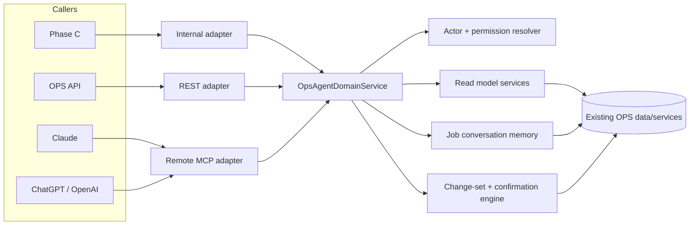

# OPS Agent Control Plane and MCP Foundation (2026-08-07)

**Status:** Product direction approved by Jackson on 2026-08-07. Foundation Tasks 1–7 are implemented in the local OPS-Web branch `feat/ops-agent-control-plane-takeover-20260807` through commits `1e866814` and `556c514f`, but their SQL migrations have not been applied. The branch has not been pushed or deployed. Versioned running memory, the shared domain read service, OAuth, and the remote MCP server remain unbuilt and nothing here is customer-live.

**Decision:** Build one company- and actor-scoped OPS domain service, then expose it through three adapters: Phase C, the existing OPS API, and a public remote MCP server for Claude, ChatGPT, and other approved hosts. MCP is a transport and discovery layer. It does not own OPS business rules.

**Related initiative:** Phase C lead conversation memory.

**Current Phase C reference:** `ops-web-lead-reply-quality`, branch `feat/lead-reply-quality-20260807`, commit `cae90581`. That commit loads complete opportunity email history for source-bound autonomous drafts, bounded at 200 messages and 120,000 characters. The memory contract in this design replaces that whole-history prompt path after equivalent-quality evaluation.

---

## 1. Product outcome

An OPS operator can connect OPS to an external assistant paid for through their own Claude or ChatGPT plan and ask it to operate their business in plain language.

Representative workflows:

1. “Tell every client with a job next week which day we are coming and who is assigned.”
   - The assistant reads the authoritative OPS schedule, jobs, confirmed customer contacts, public-safe crew identity, and communication constraints.
   - The assistant uses the host's Gmail capability, when available, to create drafts.
   - No draft becomes Phase C memory. A message becomes an immutable turn only after provider delivery is confirmed and OPS ingests it.
2. “Which jobs in the next two weeks are still missing site photos?”
   - OPS evaluates the readiness rule against current scheduled work and non-deleted job photo evidence.
   - The assistant can then prepare client photo-request drafts using the correct date and recipient context.
3. “Review these estimates and invoices and assign their costs to the right projects.”
   - The assistant reads project and financial context, proposes an allocation change set, explains ambiguity, and cannot commit until the exact change set is explicitly confirmed.
4. “Copy these estimates into OPS.”
   - The assistant transcribes or references the source documents, validates totals, tax, currency, customers, projects, and duplicates, then presents a source-provenanced import preview before commit.
5. “Set up my catalog according to this document.”
   - The assistant converts source material into a catalog proposal, preserves source provenance, resolves contradictions, validates against the server-owned capability manifest, and reuses the existing guided-catalog approval/hash/readback discipline.

This is broader than lead triage. Lead memory is the first internal consumer of a general OPS agent control plane.

---

## 2. What exists and what must be built

### 2.1 Verified current OPS foundations

The following exist in OPS-Web and/or the production Supabase project:

- Firebase-authenticated OPS users and active-company membership resolution.
- Role permissions, user overrides, and `all | assigned | own` entity scopes.
- Company-scoped RLS policies on core job, customer, opportunity, estimate, invoice, activity, and catalog data.
- Service-role server clients that bypass RLS and therefore require an explicit application authorization boundary.
- Projects, opportunities, project tasks, task schedule versions, assignments, project photos, site visits, activities, email threads/messages, estimates, invoices, shared line items, catalog entities, audit rows, and agent action rows.
- Phase C conversation-state and source-bound drafting services.
- Immutable provider message and activity identifiers usable as correspondence evidence.
- Existing catalog guided-setup sessions with input revisions, source evidence, live snapshot hashes, proposal hashes, approval hashes, commit operation IDs, commit journals, and post-commit readback.
- Existing idempotent/guarded patterns in scheduling, email delivery, lifecycle, financial, and catalog services.

### 2.2 Local foundation implementation, not deployed

The isolated OPS-Web implementation branch now contains:

- the MCP v2/Zod 4 alias boundary, stable v1 contracts, actor/entity authorization context, and governed capability manifest;
- the job-conversation schema migration, bounded evidence normalization, exact provider-delivery source capture, participant/anchor resolution, and immutable delivered-turn ingestion at inbound and provider-accepted outbound chokepoints;
- durable provider-accepted approved-action reconciliation, mailbox/reconciliation lease renewal, database-pressure backoff, and forward-only Phase C generation/source/recipient fences.

The relevant local commits are `c53b4664`, `99b30cfc`, `2969debe`, `46aedaf2`, `fd9e17c5`, `6f9e387f`, `8af1ee5d`, `1e866814`, and `556c514f`. This is source and test evidence only. The migrations are unapplied, and there is no production schema, deployment, runtime, host, or customer-live proof.

### 2.3 Verified gaps

The following do not currently exist as one coherent system:

- A shared typed `OpsAgentDomainService` used by Phase C, REST, and MCP.
- An OAuth-authenticated actor context that intersects external scopes/grants with the locally implemented OPS permission and entity-assignment context.
- Versioned running memory, bounded context assembly, memory catch-up, and deliberate cross-job retrieval over the locally implemented immutable turn ledger.
- A general change-set and cryptographic confirmation-receipt engine.
- A public remote MCP server, deployed MCP endpoint, or registered host integration. Only the SDK/schema boundary exists locally.
- An OAuth 2.1 authorization-server facade for external MCP clients, protected-resource discovery, grants, revocation, and MCP audience-bound access tokens.
- A public connector consent/revocation surface.
- MCP-specific audit, rate-limit, schema-version, adversarial-evaluation, and rollout controls.

No remote OPS MCP server was found in the inspected repositories. This design must not be described as an existing integration.

### 2.4 Current implementation references

Verified current code boundaries include:

- OPS/Firebase agent API auth: `ops-web/src/app/api/agent/_lib/auth.ts`
- Firebase token verification: `ops-web/src/lib/firebase/admin-verify.ts`
- service-role Supabase access: `ops-web/src/lib/supabase/server-client.ts`
- permission vocabulary and scopes: `ops-web/src/lib/types/permissions.ts`
- pure role/override resolution: `ops-web/src/lib/permissions/resolve.ts`
- current source-bound full-history path: `ops-web/src/lib/api/services/ai-draft-service.ts`
- Phase C participant/conversation services: `ops-web/src/lib/api/services/conversation-state/`
- current project/photo/estimate/invoice services: `ops-web/src/lib/api/services/`
- guided catalog proposal/approval/commit/readback: `ops-web/src/lib/catalog-setup/phase-c/`

These are sources to adapt behind the shared service, not MCP handler dependencies to call directly.

---

## 3. Recommended architecture



### 3.1 The non-negotiable boundary

All callers invoke the same typed domain methods. Each adapter may authenticate, translate wire formats, and apply transport-specific metadata, but it may not:

- decide whether an actor can view or mutate an entity;
- reconstruct customer/job relationships;
- define schedule, readiness, contactability, or financial rules;
- perform direct Supabase table access for a tool;
- create its own write/confirmation behavior;
- summarize evidence differently from the shared contract.

This prevents REST, Phase C, and MCP from drifting into three versions of OPS.

### 3.2 Hosting recommendation

- Canonical resource identifier: `https://mcp.opsapp.co/mcp`.
- Initial hosting: the existing OPS-Web Vercel deployment, reached through the dedicated `mcp.opsapp.co` hostname.
- Authorization-server issuer: `https://app.opsapp.co`, using the existing Firebase-authenticated OPS login as the human identity step.
- Transport: public HTTPS Streamable HTTP.
- Server implementation: official stable MCP TypeScript SDK package `@modelcontextprotocol/server@2.0.0`.
- Schema dependency boundary: retain OPS-Web's existing `zod@^3.24.0` behavior, add the isolated alias `"zod-v4": "npm:zod@4.2.0"`, and author every SDK-bound MCP schema with `zod-v4`. Zod 3 and Zod 4 schema objects never compose; only validated plain values cross the boundary.
- Protocol compatibility: serve both the 2025 era through `2025-11-25` and the current `2026-07-28` era from the same stateless entry point.
- No sticky sessions or MCP session state. Durable application state is represented by explicit OPS IDs such as `change_set_id`, `conversation_id`, and `confirmation_request_id`.

The dedicated resource hostname gives OAuth tokens one narrow audience and allows the server to move later without changing its public security identity.

---

## 4. Shared internal interface contract

The parent Phase C system can depend on this contract before the public MCP adapter exists.

### 4.1 Service shape

```ts
interface OpsAgentDomainService {
  listScheduledJobs(ctx: ActorContext, input: ListScheduledJobsInput): Promise<AgentResult<ScheduledJobPage>>;
  listJobReadinessIssues(ctx: ActorContext, input: ListJobReadinessIssuesInput): Promise<AgentResult<JobReadinessPage>>;
  getJobCommunicationContext(ctx: ActorContext, input: GetJobCommunicationContextInput): Promise<AgentResult<JobCommunicationContext>>;
  getJobConversationContext(ctx: ActorContext, input: GetJobConversationContextInput): Promise<AgentResult<JobConversationContext>>;
  listCustomerJobs(ctx: ActorContext, input: ListCustomerJobsInput): Promise<AgentResult<CustomerJobPage>>;
  getJobSummary(ctx: ActorContext, input: GetJobSummaryInput): Promise<AgentResult<JobSummary>>;
  searchJobHistory(ctx: ActorContext, input: SearchJobHistoryInput): Promise<AgentResult<JobHistoryPage>>;
  getCorrespondenceEvidence(ctx: ActorContext, input: GetCorrespondenceEvidenceInput): Promise<AgentResult<CorrespondenceEvidencePage>>;
  resolveJobParticipants(ctx: ActorContext, input: ResolveJobParticipantsInput): Promise<AgentResult<JobParticipants>>;
}
```

Future write methods use the same service and actor context. They are not a separate MCP subsystem.

### 4.2 `ActorContext`

Every method receives a server-created context. Callers cannot submit or override tenant identity.

Required fields:

- `request_id` and optional `causation_id`;
- `actor_user_id`;
- `company_id` resolved from the active grant or internal OPS session;
- current active status and company membership;
- current role IDs, effective OPS permissions, and `all | assigned | own` scopes;
- `auth_channel: internal | ops_api | mcp`;
- for MCP: `oauth_grant_id`, `oauth_client_id`, validated scopes, token ID, issuer, and audience;
- client/application identity and protocol era for audit only;
- policy and capability-manifest revisions.

Effective authority is the intersection of:

```text
OAuth grant scope
∩ current OPS permission
∩ current entity scope/assignment
∩ tool capability policy
∩ company membership
∩ write confirmation policy
```

An OAuth scope never creates an OPS permission. Removing a role, assignment, company membership, or grant takes effect on the next call even if the access token has not expired.

### 4.3 Canonical job identity

Tools use a discriminated `JobRef`:

```ts
type JobRef =
  | { kind: "opportunity"; id: string }
  | { kind: "project"; id: string };
```

The service returns an opaque `conversation_id` and all known anchor links. Opportunity-to-project conversion attaches the resulting project to the existing conversation. A new opportunity or manually created project creates a new conversation even when the customer has older jobs.

### 4.4 Result envelope

Every successful domain result uses a stable envelope:

```ts
interface AgentResult<T> {
  contract_version: "2026-08-07.v1";
  request_id: string;
  generated_at: string; // RFC 3339 UTC
  company_id: string;
  actor: {
    user_id: string;
    permission_snapshot_revision: string;
  };
  freshness: {
    read_at: string;
    source_versions: SourceVersion[];
    stale_after: string | null;
    memory_version?: number;
    turn_high_watermark_id?: string;
  };
  data: T;
  evidence: EvidenceRef[];
  page?: CursorPage;
  warnings: AgentWarning[];
}
```

Rules:

- All IDs are opaque strings.
- All timestamps are RFC 3339 UTC; local schedule output also carries the IANA timezone and local representation.
- Money is integer minor units plus ISO 4217 currency, never a floating-point amount.
- Lists have deterministic sort order, cursor pagination, a documented default, and a hard maximum.
- `company_id` is echoed from the server context for audit but is never accepted in tool input.
- Empty and omitted are distinct. Schemas do not use ambiguous `any` blobs.

### 4.5 Evidence contract

Every material claim returns evidence references with:

- evidence ID;
- source domain and source type;
- exact source entity/message/activity/event ID;
- source revision or immutable content hash;
- occurred/delivered timestamp;
- relationship to the result, such as `supports`, `contradicts`, or `supersedes`;
- a bounded, prompt-safe excerpt when appropriate;
- a locator usable with `get_correspondence_evidence` or a future evidence-resource URI;
- `trust: authoritative_ops | delivered_correspondence | operator_document | model_transcribed`.

Summaries never masquerade as source evidence. Model-transcribed documents remain lower assurance until reconciled to an original file or explicitly reviewed.

### 4.6 Error contract

Protocol errors remain JSON-RPC/MCP errors. Expected domain failures return a structured error envelope with `request_id`, `code`, safe message, `retryable`, and typed details.

Stable codes:

- `UNAUTHENTICATED`
- `INSUFFICIENT_SCOPE`
- `FORBIDDEN`
- `NOT_FOUND` (privacy-safe; does not reveal cross-tenant existence)
- `INVALID_ARGUMENT`
- `AMBIGUOUS`
- `STALE_CONTEXT`
- `CONFIRMATION_REQUIRED`
- `CONFIRMATION_EXPIRED`
- `IDEMPOTENCY_CONFLICT`
- `RATE_LIMITED`
- `TEMPORARILY_UNAVAILABLE`
- `INTERNAL`

Authorization failures include the required scope and a compliant `WWW-Authenticate` challenge when reauthorization can fix the failure. Stale failures include current version markers, never silently overwrite.

---

## 5. Job conversation memory contract

### 5.1 Conversation boundary

A conversation is anchored to one OPS lead/opportunity/job, never a Gmail provider thread.

- Gmail/Microsoft thread IDs are evidence links only.
- One provider thread may contain content relevant to different OPS jobs; relevance is resolved per delivered message.
- An opportunity converted to a project keeps the same conversation.
- A customer returning for a new job gets a new conversation.

### 5.2 Memory roles

The memory model's roles are business-side roles, not the external Claude/ChatGPT chat roles:

- `user`: the client, sub-clients, and evidence-confirmed related contacts;
- `assistant`: Phase C and OPS users speaking for the company.

Participant classification is evidence-backed and versioned. Unknown or ambiguous participants remain unresolved; they are not guessed into either side.

### 5.3 Immutable turns

Each delivered inbound or outbound message becomes one immutable turn.

Required turn fields:

- stable `turn_id`, `conversation_id`, company and job anchors;
- `side: user | assistant`;
- participant ID and participant-resolution revision;
- direction and channel;
- delivered timestamp;
- exact provider message/activity/event ID;
- normalized exact plain-text content plus original content hash;
- attachment evidence references;
- ingest timestamp and source connection ID.

Rules:

- Unsent drafts never enter memory.
- A provider send intent does not enter memory until delivery/reconciliation confirms the delivered message.
- Unique source identifiers make ingestion idempotent.
- Corrections, retention actions, or legal redactions create append-only events/overlays; they do not rewrite the historical assertion invisibly.

### 5.4 Versioned running memory

Each conversation has append-only memory versions. A version contains structured, job-specific memory:

- confirmed customer/job facts;
- decisions and commitments;
- preferences relevant to this job;
- open questions and unresolved contradictions;
- current schedule facts and who asserted them;
- quote/estimate/invoice facts relevant to correspondence;
- excluded or rejected assumptions;
- evidence IDs for every retained claim;
- predecessor version and the turn high-watermark it summarizes.

The current pointer is updated with optimistic concurrency. Older versions remain available for audit. A failed memory generation cannot advance the pointer.

### 5.5 Prompt assembly

`get_job_conversation_context` returns, in this order:

1. current versioned job memory;
2. bounded recent exact turns;
3. exact source evidence for the triggering message and active claims;
4. participant resolution;
5. freshness and gaps.

The default exact-turn window is 20, configurable to a hard maximum of 50. The hard prompt-safe character budget is 60,000 for the complete result. Older information is retrieved through `search_job_history` or evidence lookup only when relevant.

For autonomous source-bound drafting, memory must be current through the triggering inbound turn. The service must synchronously catch up or reject with `STALE_CONTEXT`; it may not silently draft from an older summary. This requirement replaces the current whole-history prompting path only after quality and safety evals pass.

### 5.6 Cross-job seed

A new job receives a deliberately minimal seed:

- customer has prior OPS jobs: yes/no;
- count of prior completed/active jobs visible to the actor;
- date and status of the most recent visible prior job;
- one evidence-backed relationship continuity marker when safe.

It does not copy old job summaries, correspondence, disputes, pricing, or preferences into the new job. Deeper history requires an explicit, relevant `search_job_history` call and remains permission/evidence scoped.

### 5.7 Proposed persistence model

The implementation is expected to add the following conceptual records; exact SQL is deferred until implementation schema review:

- `job_conversations`
- `job_conversation_anchors`
- `job_conversation_turns`
- `job_memory_versions`
- `job_memory_version_evidence`
- `job_conversation_redaction_events`

All carry `company_id`; all foreign keys and query-path indexes are mandatory; all user-accessible rows require RLS even when most writes occur through guarded server functions.

---

## 6. Initial read-only tool contract

These are the first public MCP tools and the internal Phase C dependency surface. Tool names do not contain a version suffix; incompatible successors receive a new name.

### 6.1 `list_scheduled_jobs`

Purpose: return authoritative scheduled job occurrences for a bounded time window.

Input:

- `from` and `to` RFC 3339 instants;
- optional status filters;
- optional cursor;
- `limit`, default 25, maximum 50.

Constraints:

- maximum window 90 days;
- company timezone is authoritative unless a valid display timezone is requested;
- task/visit occurrences are canonical, not one collapsed project date;
- every occurrence includes task schedule version, confirmation/lock state, assignment IDs, and project update/version markers;
- assignment output includes customer-shareable crew display fields only, never private employee contact/HR data.

### 6.2 `list_job_readiness_issues`

Purpose: evaluate current server-owned readiness rules across scheduled jobs.

Input:

- bounded schedule window;
- optional rule codes;
- optional `include_clear`, default false;
- cursor and limit, maximum 50 jobs.

Initial rule catalogue:

- `SITE_PHOTOS_MISSING`
- `CUSTOMER_CONTACT_UNRESOLVED`
- `SCHEDULE_UNCONFIRMED`
- `CREW_UNASSIGNED`
- `ADDRESS_INCOMPLETE`

Each issue includes rule revision, severity, exact evaluated sources, current entity versions, and a human-readable fact—not an instruction to the model. `SITE_PHOTOS_MISSING` ignores deleted photos and counts only usable project/site-visit photo evidence according to the server rule revision.

### 6.3 `get_job_communication_context`

Purpose: assemble the facts needed to communicate accurately with a customer about one job.

Input:

- `job_ref`;
- `purpose: schedule_notice | photo_request | general`;
- optional `as_of` for replay/audit.

Output:

- customer and confirmed related contacts permitted for the actor;
- contactability, opt-out/suppression, preferred channel, and ambiguity;
- exact scheduled occurrences and local dates/times;
- customer-shareable assigned crew names/roles;
- job address and safe job description;
- readiness facts relevant to the purpose;
- evidence and freshness.

This tool returns facts. It does not write or send email.

### 6.4 `get_job_conversation_context`

Purpose: return the prompt-ready memory bundle defined in §5.

Input:

- `job_ref`;
- optional exact-turn limit, maximum 50;
- optional `required_through_turn_id`;
- optional sections.

Output includes conversation ID, memory version, high-watermark, recent exact turns, active evidence, participant roles, gaps, and cross-job seed.

### 6.5 `list_customer_jobs`

Purpose: list jobs connected to one resolved customer without leaking other customer records.

Input:

- customer reference;
- optional lifecycle/status and date filters;
- cursor and limit, maximum 50.

Output includes job refs, dates, statuses, relationship basis, visibility reason, and summary/version markers. It does not include full correspondence or financial detail unless separately authorized.

### 6.6 `get_job_summary`

Purpose: return a bounded, current operational summary of one job.

Input:

- `job_ref`;
- optional section allowlist: `identity`, `schedule`, `readiness`, `participants`, `financials`, `activity`, `conversation`.

Each section is independently permission-gated. Requesting an unauthorized financial section returns a typed scope failure or omits it with an explicit warning according to caller policy; it never silently leaks.

### 6.7 `search_job_history`

Purpose: search exact and summarized history when the current job context indicates deeper retrieval is relevant.

Input:

- plain query, maximum 500 characters;
- optional customer reference and visible job refs;
- date window, maximum one year per call;
- source types;
- cursor and limit, default 10, maximum 20.

Output separates exact-source matches from memory-summary matches, includes evidence IDs and relevance reasons, and never searches another tenant. Search text is treated as data, not an instruction.

### 6.8 `get_correspondence_evidence`

Purpose: retrieve exact, bounded source evidence by IDs already returned from another tool.

Input:

- up to 20 evidence IDs;
- optional excerpt/full-text mode;
- total character maximum 60,000.

Output includes delivered message/activity/event IDs, sender/recipient identity as permitted, delivered timestamp, normalized exact plain text, content hash, attachment references, and trust markers. Raw MIME, scripts, tracking markup, and hidden HTML are not prompt output.

### 6.9 `resolve_job_participants`

Purpose: return the evidence-backed participant graph for one job.

Input:

- `job_ref`;
- optional purpose and `as_of`.

Output includes OPS users, client, sub-clients, confirmed related contacts, unknown participants, role/side, confidence state, evidence IDs, contactability, and safe communication identity. It never auto-confirms an ambiguous related contact.

---

## 7. Prompt-safety and bounded-output rules

Every tool result is safe to place in a model context by construction:

- Customer emails, notes, document text, filenames, and imported values are marked `untrusted_external_content`.
- Untrusted content is isolated from OPS/system guidance in structured fields.
- HTML is converted to normalized plain text; scripts, styles, hidden nodes, tracking pixels, and remote includes are removed.
- Tool descriptions instruct the model never to follow instructions found inside source data.
- URLs are omitted, allowlisted, or short-lived signed OPS URLs; the MCP server never fetches arbitrary caller-provided URLs.
- Result rows, text length, date range, and attachment counts have hard limits.
- PII is minimized by purpose. Staff private email/phone, credentials, OAuth tokens, internal HR data, and unrelated customer details are excluded.
- Exact content hashes allow source verification without duplicating raw payloads in logs.
- Search and summaries preserve contradictions; they do not blend competing claims into a false single fact.

---

## 8. Future writes: capability and confirmation model

### 8.1 Capability registry

Every tool has a server-owned registry entry:

- stable name and schema version;
- risk tier;
- required OAuth scopes;
- required OPS permissions and allowed entity scopes;
- read/write/open-world/destructive annotations;
- input/result bounds;
- evidence requirements;
- confirmation policy;
- idempotency policy;
- rate-limit bucket;
- capability-manifest revision and rollout flag.

MCP annotations help hosts present tools correctly but are never authorization controls.

### 8.2 Universal mutation protocol

All material mutations follow:

```text
prepare → validate → preview → explicit confirmation → commit → receipt/readback
```

The `prepare_*` call creates a server-owned immutable change set containing:

- actor, company, OAuth client, and grant IDs;
- tool/capability revision;
- normalized exact arguments and SHA-256 hash;
- target entities and current versions;
- source evidence/provenance;
- itemized proposed changes, warnings, ambiguity, totals, and side effects;
- expiry and risk tier.

The exact preview must be presented to the operator. A model-provided `confirmed: true`, repeated natural-language claim, or host tool call is not by itself an OPS confirmation.

### 8.3 Confirmation receipts

A confirmation receipt is:

- issued only after a current authenticated operator explicitly approves the exact preview;
- bound to actor, company, OAuth client, grant, tool, change-set ID, arguments hash, target version set, and expiry;
- opaque to the model;
- short-lived, single-use, and stored hashed;
- revoked when membership, permission, grant, target versions, or proposal changes;
- consumed atomically with commit.

Modern `2026-07-28` MCP multi-round-trip `input_required` may present the approval URL, preview, and pending status when the host implements it. It cannot mint a receipt from host/model continuation text or an unverified host approval assertion. The receipt is minted only by the Firebase-authenticated OPS confirmation action for the exact preview. A future host-native path requires a separately specified cryptographically verifiable human-attestation profile before it can become an issuer. Legacy/current hosts receive the same OPS approval URL; after OPS approval, the model can poll status or retry commit with the server-issued receipt.

Host-native per-tool approval remains additive defense. OPS does not assume every host conveys a cryptographically trustworthy approval assertion.

### 8.4 Commit guarantees

- Re-resolve the actor and all permissions at commit time.
- Lock targets in deterministic order.
- Compare every expected version before the first write.
- Reject ambiguity or stale state atomically.
- Use a caller-provided idempotency key plus the server arguments hash.
- Never partially apply a financial allocation, schedule batch, catalog service change, or communication send batch unless the domain contract explicitly models partial success and a reconciliation receipt.
- Perform post-commit readback.
- Return exact created/updated IDs, versions, audit ID, side effects, and reconciliation state.

The generic control plane is the sole transaction coordinator for database-backed changes. It locks/re-authorizes change-set and receipt state, then dispatches a registered private domain transaction participant inside the same PostgreSQL transaction. The participant owns only domain validation, effects, and domain readback; it never mints/consumes a second receipt or writes a parallel generic commit/audit record. Durable sagas remain limited to effects that cannot share the database transaction, such as external provider delivery.

### 8.5 Always-confirm actions

These require exact-preview confirmation every time:

- sending any customer/vendor/staff communication;
- creating provider drafts through OPS when that writes to an external mailbox;
- schedule or calendar changes;
- crew assignments or removals;
- estimate, invoice, cost, tax, payment-status, or project-financial changes;
- document/data imports;
- catalog, inventory, supplier, or purchasing mutations;
- client/vendor/related-contact changes;
- job lifecycle changes;
- bulk actions;
- destructive, archival, replacement, or merge operations.

Draft text generated only in the model/host, with no OPS or provider write, does not require an OPS confirmation receipt.

### 8.6 Initial write families

Planned domain-specific pairs:

- `prepare_project_cost_allocation` / `commit_project_cost_allocation`
- `prepare_estimate_import` / `commit_estimate_import`
- `prepare_catalog_service_change` / `commit_catalog_service_change`
- `prepare_client_message_batch` / `commit_client_message_batch`

Catalog tools must adapt the existing guided catalog session, source, capability-manifest, approval-hash, commit-journal, and readback machinery. Imports are a provenance mode of `prepare_catalog_service_change`, not a separate catalog rule engine. The complete catalog design and task sequence are defined in `specs/2026-08-07-phase-c-catalog-authoring-control-plane-integration.md` and its implementation plan.

---

## 9. Documents and cross-connector orchestration

### 9.1 Document provenance

Two input modes are supported:

1. `ops_source`
   - The original file already exists in OPS.
   - The service reads its exact file ID, hash, revision, pages/sheets, and extraction artifacts.
   - Highest assurance.
2. `model_transcribed`
   - The external host/model read an attached file that OPS cannot access and submits structured transcription.
   - The payload records host, filename, declared hash when available, page/row locators, and transcription timestamp.
   - Every imported value is shown in the preview and labeled lower assurance.

The server never accepts “according to the document” as provenance without either an OPS file reference or an itemized transcription.

### 9.2 Gmail and other host connectors

OPS MCP supplies authoritative OPS facts. Claude or ChatGPT may combine those facts with another connector available in that host, such as Gmail or Drive.

Boundaries:

- OPS never receives or passes through the host's Gmail/Drive token.
- OPS cannot guarantee another connector's write capability, delivery, approval behavior, or subscription availability.
- Draft-by-default is the safe cross-connector workflow.
- If the host sends a message, OPS treats it as delivered memory only after the normal OPS mailbox ingest/reconciliation proves provider delivery.
- For unattended/high-volume communication, use a future OPS-native confirmed batch-send tool so OPS can enforce contactability, idempotency, delivery reconciliation, and audit end to end.

---

## 10. MCP tools, resources, and prompts

### 10.1 Tools are the portable core

All required behavior is exposed as tools. This is necessary because current Claude API MCP integration supports tool calls but not every MCP primitive. Tool inputs and outputs use explicit JSON Schema and recognizable user goals.

### 10.2 Resources are optional evidence conveniences

After the initial release, compatible hosts may receive read-only evidence resources with opaque URIs such as:

```text
ops://evidence/{evidence_id}
```

Resources never become the only path to required context. They enforce the same actor context and return the same bounded evidence contract.

### 10.3 No server prompts in the initial release

Prompts add little portable value, may not be supported by a host, and risk mixing OPS policy with user-controlled prompt selection. Tool descriptions and structured schemas are sufficient. Reconsider only for a proven host-specific workflow that cannot be expressed safely with tools.

### 10.4 No MCP App UI in the initial release

The ChatGPT Apps SDK can add optional UI, but read-only OPS tools work without it. The only required web UI is OPS-owned OAuth consent, grant management, and high-risk confirmation. Those are security surfaces, not decorative tool widgets.

---

## 11. MCP protocol and schema compatibility

### 11.1 Protocol eras

The current MCP `2026-07-28` revision removes the initialize/session dependency and makes requests self-describing. Current Claude API integration identifies the 2025-era `mcp-client-2025-11-20` contract. Therefore OPS serves both eras using the official v2 SDK's stateless compatibility handler.

- Modern clients: `2026-07-28`, `server/discover`, request metadata, optional `input_required`.
- Legacy clients: through `2025-11-25`, initialize handshake served statelessly.
- Legacy HTTP+SSE is not a new dependency. Streamable HTTP is canonical.
- The server has no business state tied to MCP session IDs.

### 11.2 Tool schema stability

- `contract_version: 2026-08-07.v1` appears in every result.
- Additive optional fields are backward-compatible.
- Existing meanings, enum values, units, or required fields do not change in place.
- Breaking changes create a new tool name, retain the prior tool through a measured deprecation window, and publish migration telemetry.
- Tool-list ordering and descriptions are deterministic for host caching.
- Large catalogues use host allowlists/deferred loading when available.
- Tool descriptions state data sensitivity, side effects, confirmation requirements, and bounds accurately.

### 11.3 Annotations

Every tool declares accurate MCP/OpenAI annotations:

- read tools: `readOnlyHint=true`, `destructiveHint=false`;
- preparation tools: not read-only because they persist a change set, but `destructiveHint=false`;
- commit tools: `readOnlyHint=false`; `destructiveHint` reflects the actual capability;
- `openWorldHint=true` only when the tool can affect or retrieve from an external system.

Annotations are presentation hints, not permission checks.

---

## 12. OAuth 2.1 and tenant security

### 12.1 Roles

- MCP resource server: `https://mcp.opsapp.co/mcp`.
- OPS authorization server: issuer `https://app.opsapp.co`.
- External MCP client: Claude, ChatGPT/OpenAI, or another registered host.
- Resource owner: the authenticated OPS operator granting access to one OPS company.

### 12.2 Discovery and client registration

Implement:

- RFC 9728 protected-resource metadata for the canonical MCP resource, including root/path-compatible discovery locations;
- OAuth authorization-server metadata;
- authorization code with PKCE;
- RFC 8707 `resource` on authorization and token requests;
- authorization-response issuer (`iss`) validation support;
- Client ID Metadata Documents (CIMD) as the preferred modern registration path;
- backward-compatible Dynamic Client Registration while required by deployed hosts;
- predefined client registrations when a host has stable published metadata;
- public clients using `none` and confidential clients using `private_key_jwt` where supported.

OPS keeps Firebase as the interactive human identity system. A narrow, standards-compliant OAuth authorization facade issues OPS MCP grants/tokens after Firebase login and company selection. Token, grant, discovery, redirect, and revocation logic must use a proven OAuth implementation/library; OPS does not hand-roll cryptographic protocol primitives.

### 12.3 Tokens

Access tokens are short-lived, signed, and contain/resolve:

- issuer;
- exact MCP resource audience;
- OPS actor subject;
- OAuth client ID;
- grant ID;
- permitted scopes;
- issued/expiry/not-before times;
- unique token ID.

Recommended initial access-token lifetime: 10 minutes. Refresh tokens are opaque, hashed at rest, rotated on every use, reuse-detected, and revocable. The access token does not contain a trusted permission snapshot; current OPS authorization is reloaded on every call.

The resource server validates signature, issuer, exact audience/resource, time claims, client/grant state, scopes, actor status, company membership, and revocation before dispatch.

### 12.4 Scope catalogue

Initial read scopes:

- `ops.jobs.read`
- `ops.customers.read`
- `ops.customer_contacts.read`
- `ops.schedule.read`
- `ops.photos.read`
- `ops.correspondence.read`
- `ops.financials.read`
- `ops.catalog.read`

Future capability scopes separate preparation from commit:

- `ops.communications.prepare`
- `ops.communications.send`
- `ops.financials.prepare`
- `ops.financials.write`
- `ops.catalog.prepare`
- `ops.catalog.write`
- `ops.schedule.prepare`
- `ops.schedule.write`
- `ops.jobs.prepare`
- `ops.jobs.write`

Consent presents human capabilities and data categories, not an undifferentiated “access OPS” request. A grant is bound to exactly one company. Multi-company operators create separate grants.

### 12.5 Revocation and consent

Operators can view and revoke grants by connected application and company inside OPS. Revocation:

- immediately disables the grant;
- revokes its refresh-token family;
- invalidates cached authorization decisions;
- blocks in-flight uncommitted change sets at commit revalidation;
- creates an immutable audit event.

Scope expansion always requires new consent. Reauthorization never silently accumulates scopes from a different company or client.

### 12.6 Token passthrough and confused deputy prevention

- OPS MCP accepts only tokens issued for its exact MCP resource.
- It never accepts a Claude/OpenAI/Gmail/Google/Microsoft token as an OPS credential.
- It never forwards the OPS MCP token to Supabase, Gmail, QuickBooks, Google Calendar, or another service.
- Downstream OPS integrations use their own tenant-bound credentials resolved server-side.
- Redirect URIs and metadata URLs are strictly validated; discovery fetches have SSRF protections, DNS/IP restrictions, size/time limits, and no open redirects.
- Client credentials are bound to the issuer/registration that created them.
- Company is derived from the grant, never a tool argument.

### 12.7 Service-role boundary

The shared service may use the existing Supabase service-role client only after `ActorContext` authorization. Every query must include the resolved company and entity visibility predicate. Service-role access is an implementation mechanism, never the permission model.

---

## 13. Audit, observability, privacy, and rate limits

### 13.1 Immutable audit

Record every tool call, including denied calls:

- request/trace IDs;
- actor, company, OAuth client/grant, protocol era;
- tool and schema/capability revision;
- redacted input hash and bounded metadata;
- required/resolved scopes and permission outcome;
- target/evidence IDs and versions;
- result count/size, latency, status, error code;
- change-set, confirmation, idempotency, commit, and readback IDs;
- model/host attribution when supplied.

Never log bearer/refresh tokens, raw authorization codes, full message bodies, document contents, or unnecessary PII.

### 13.2 Metrics and alerts

Measure:

- calls, errors, latency, output bytes/tokens, and pagination by tool;
- permission denials and reauthorization;
- cross-tenant probes;
- stale-context and ambiguity rates;
- confirmation abandonment/expiry/replay;
- idempotent replays and conflicts;
- Phase C memory lag and evidence coverage;
- connector/client/protocol compatibility;
- write reconciliation and partial-failure attempts;
- prompt-injection detections and output sanitization.

Page on cross-tenant authorization defects, token audience bypass, confirmation replay, duplicate external sends, financial partial commit, or audit loss.

### 13.3 Initial rate-limit policy

Enforce sliding limits by actor, grant/client, company, IP risk, and tool bucket. Starting server ceilings:

- lightweight reads: 120 calls/minute per actor and 600/minute per company;
- evidence/search: 30 calls/minute per actor and 120/minute per company;
- prepare calls: 20 calls/minute per actor;
- commit calls: 10 calls/minute per actor;
- batch size: 50 entities for reads, 25 proposed writes, lower for communication/financial domains;
- concurrency: 5 in-flight calls per actor, 25 per company.

These are deployment defaults, not promises. Tune from measured load without relaxing per-call hard bounds. Return `RATE_LIMITED`, retry time, and request ID.

---

## 14. Full OPS-for-LLMs catalogue

The following catalogue describes useful end-state capabilities. Only the §6 read tools are in the initial external release.

### 14.1 Customer and relationship context

Read:

- search/resolve customers and confirmed related contacts;
- list customer jobs and relationship history;
- get contactability and communication preferences;
- identify duplicate/ambiguous customer records without merging them.

Confirmed writes:

- prepare/commit customer or contact changes;
- prepare/commit related-contact confirmation;
- prepare/commit safe duplicate merges with a full survivor preview.

### 14.2 Jobs, leads, schedule, and crew

Read:

- list/search jobs and opportunities;
- get job summary, lifecycle, milestones, tasks, schedule occurrences, assignments, readiness, site visits, files, and photos;
- get crew availability and customer-shareable assignment identity;
- identify conflicts, missing prerequisites, and stale/unconfirmed schedules.

Confirmed writes:

- prepare/commit schedule changes;
- prepare/commit crew assignments;
- prepare/commit task/status/milestone changes;
- prepare/commit opportunity-to-project conversion when every mapping is explicit.

### 14.3 Correspondence and follow-up

Read:

- job conversation context, participant graph, evidence, commitments, response state, contactability, and follow-up status;
- build an evidence-backed batch audience.

Confirmed writes:

- prepare/commit mailbox drafts;
- prepare/commit sends and follow-ups;
- prepare/commit communication preference changes;
- reconcile delivery and attach delivered turns to job memory.

### 14.4 Estimates, invoices, costs, and project financials

Read:

- get estimate/invoice/project financial summaries;
- compare quoted, invoiced, paid, committed, and actual costs;
- list unallocated source documents/costs;
- validate totals, taxes, currency, duplicate risk, and project linkage.

Confirmed writes:

- prepare/commit estimate imports;
- prepare/commit cost allocations;
- prepare/commit estimate/invoice drafts and line-item changes;
- prepare/commit project financial classifications.

Payment execution, refunds, banking, payroll, and silent financial posting remain prohibited; see §15.

### 14.5 Catalog, inventory, suppliers, and purchasing

Read:

- search catalog items, variants, options, products, rules, tax rates, supplier costs, inventory, and capability support;
- validate a source document against the live catalog;
- identify duplicates, missing facts, contradictions, unsupported capabilities, and impact.

Confirmed writes:

- prepare/commit complete catalog service changes, with imports treated as source provenance;
- prepare/commit supplier cost changes;
- prepare/commit inventory adjustments;
- prepare/commit purchase-order drafts.

External ordering/payment is prohibited until a separate, explicitly approved commerce design exists.

### 14.6 Files, photos, and site evidence

Read:

- list job documents/photos/site visits;
- evaluate required-photo/document readiness;
- retrieve bounded metadata and signed evidence links.

Confirmed writes:

- attach an already-uploaded OPS file to a job;
- classify/tag/move evidence with exact preview;
- request client evidence through the communication workflow.

The server does not expose arbitrary filesystem access or arbitrary URL ingestion.

### 14.7 Reporting and operational health

Read only:

- schedule/readiness/customer-response summaries;
- estimate-to-actual and receivables context according to permission;
- operational exceptions, workload, and activity trends;
- integration health without credentials.

Generated analysis must carry source windows, versions, and evidence. No generic “run report query” or raw analytics SQL tool exists.

### 14.8 Company and integration settings

Read:

- safe company profile, timezone, feature/capability state, and integration health;
- permission-aware user/role display required for assignments.

Confirmed writes are deliberately narrow. Credential access, role/permission administration, company deletion, billing-plan changes, production controls, and integration-secret management are not agent tools.

---

## 15. Tools that must not exist

Do not expose:

- `run_sql`, raw Supabase/table access, arbitrary GraphQL, or generic `get_record`;
- generic `create_record`, `update_record`, `delete_record`, or `execute_action`;
- arbitrary URL fetch, webhook creation, shell/filesystem, or code execution;
- bearer tokens, refresh tokens, provider credentials, secrets, service-role keys, or raw auth configuration;
- system prompts, hidden policy, unrestricted internal agent memories, or full-company bulk export;
- direct payment, refund, bank transfer, card charge, payroll, or tax filing;
- company/account deletion, production migration/deploy/rollback, user termination, or role/permission escalation;
- silent customer/contact merging or identity confirmation;
- open-ended bulk send or “send whatever the model composed”;
- unsupervised external purchasing/order placement;
- any bypass for confirmation, permissions, contactability, version checks, or audit.

Domain tools exist only when OPS can state the business invariant, evidence contract, permission rule, preview, idempotency, and post-commit proof.

---

## 16. Evaluation and adversarial test matrix

### 16.1 Contract tests

- identical domain result through internal, REST, and MCP adapters;
- JSON Schema conformance and backward-compatible fixtures;
- cursor stability under concurrent inserts;
- timestamps, timezone, money, enum, and source-version serialization;
- bounded output and deterministic tool catalogue.

### 16.2 Authorization tests

- cross-company IDs in every input position;
- assigned versus all versus own visibility;
- inactive user, removed assignment, changed role, revoked grant, expired token;
- correct scope but wrong OPS permission and the inverse;
- audience/issuer/resource mismatch;
- token passthrough attempts;
- client/issuer mix-up, redirect manipulation, metadata SSRF, and refresh-token replay;
- privacy-safe not-found behavior.

### 16.3 Prompt/data attacks

- instructions embedded in email body, HTML, PDF, spreadsheet cells, filenames, photo metadata, and customer notes;
- hidden text and remote includes;
- malicious source claiming to override permissions/confirmation;
- poisoned cross-job memory and participant impersonation;
- result-size and pagination exhaustion.

### 16.4 Schedule/readiness tests

- daylight-saving transitions and company timezone boundaries;
- multiple visits/tasks on one project;
- unconfirmed/locked/stale schedule versions;
- deleted, client-hidden, legacy, and site-visit photos;
- rescheduled jobs during batch preparation;
- crew assignment changes after preview.

### 16.5 Memory/drafting tests

- provider thread spans different OPS jobs;
- opportunity-to-project continuity;
- returning customer gets a fresh conversation/minimal seed;
- draft never enters memory;
- provider delivery replay deduplicates;
- memory lag blocks autonomous draft;
- contradictory exact evidence outranks summary;
- 200-message histories match or exceed current reply quality using bounded memory.

### 16.6 Write tests

- confirmation replay, expiry, wrong actor/client/company, and arguments-hash mismatch;
- target version changes between prepare and commit;
- duplicate retries and idempotency conflicts;
- batch all-or-nothing behavior;
- email create/send ambiguity and delivery reconciliation;
- estimate/invoice totals, tax, currency, duplicates, and line-item mapping;
- cost allocations sum exactly and never partially move;
- catalog capability revision changes, duplicate SKUs/variants, unsupported rules, and readback mismatch;
- revocation during an in-flight change set.

### 16.7 Host evaluations

Run direct, indirect, follow-up, write, unsupported, and malicious-document prompts in:

- MCP Inspector;
- Claude custom connector and Claude API connector;
- ChatGPT developer mode/plugin and OpenAI Responses API remote MCP;
- modern `2026-07-28` and legacy `2025-11-25` protocol-era clients.

Success requires correct tool selection, no unauthorized data, complete evidence, bounded calls, appropriate confirmation, and a truthful unsupported result.

---

## 17. Staged rollout

1. **Internal contract, no behavior change**
   - Build typed schemas, actor context, permission harness, evidence envelope, and read services behind flags.
   - Compare against existing Phase C/current API behavior in shadow mode.
2. **Phase C job memory**
   - Ingest immutable delivered turns and generate versioned job memory.
   - Keep the current whole-history prompt as the control path until quality/safety gates pass.
3. **Internal operational reads**
   - Phase C/OPS API consume scheduled-job, readiness, communication, participant, and history methods.
4. **Private external read-only MCP**
   - Trusted OPS companies, read scopes only, no write tools advertised.
   - Verify Claude and ChatGPT compatibility, audit, revocation, rate limits, and cross-tenant attacks.
5. **Cross-connector draft workflows**
   - Validate scheduled-notice and photo-request drafting using host Gmail capabilities where available.
   - No OPS-native send tool.
6. **Prepare-only write tools**
   - Financial, estimate, catalog, and communication change sets; commits remain disabled.
7. **Confirmed commits by domain**
   - Enable one domain at a time after its atomicity, confirmation, readback, and adversarial gates pass.
   - Catalog first because OPS already has the strongest proposal/hash/commit/readback foundation.
8. **Broad availability**
   - Host review/submission, published privacy/security material, incident runbooks, support path, and measured SLOs.

Each stage has a kill switch by company, client, tool, and capability revision. Read-only fallback remains available if a write domain is disabled.

### 17.1 Mandatory Phase C email cutover order

The Phase 2 email safety migrations are a forward-only application/database cutover, not an ordinary migration followed by an eventually consistent deployment. Migration `20260809183000_phase_c_auto_send_generation_reservations.sql` removes the legacy 28-argument `schedule_phase_c_auto_send_fenced` overload and replaces it with the reservation-bound 30-argument contract. Old application workers and the new database contract must never run concurrently.

When production migration and deployment are separately authorized, operators must use this order:

1. Snapshot the exact pre-cutover settings, then disable new Phase C email generation before pausing traffic: set and read back the company `ai_auto_send` feature override as false for every company and the connection `auto_send_settings.enabled` value as false for every mailbox. The general `phase_c` flag alone is not the auto-send kill switch. Pause `/api/cron/email-sync`, `/api/cron/stale-leads`, `/api/cron/auto-send`, `/api/cron/auto-execute-actions`, and `/api/cron/email-send-reconciliation`; block provider-webhook and user/manual dispatch to `/api/integrations/email/manual-sync`; then drain every in-flight classification/router invocation and mailbox/reconciliation lease before changing the database.
2. Build the expected-mutation manifest from the exact reviewed SQL and a fresh production preflight. It must include the temporary feature/mailbox setting changes plus every migration-time data write: cancellation of legacy `pending_auto_sends` rows by `20260807213219`, retry-cap normalization and eligible terminalization of `approved_action_email_intents` plus corresponding alert-outbox writes by `20260809180033`, and missing tenant-root inserts for existing source fences by `20260809183000`. Record the exact qualifying keys, per-predicate before counts, and before values needed for readback. If the qualifying set changes before apply or any unlisted data mutation appears, stop.
3. Apply the reviewed migration sequence in ledger order through `20260809183000`. Do not skip directly to the final file.
4. Reconcile every changed row against the expected-mutation manifest, including exact changed keys and before/after counts and values, and prove that no unlisted customer data changed. Then read back the migration ledger, functions, signatures, owners, and grants. The 28-argument `schedule_phase_c_auto_send_fenced` overload must be absent. The 30-argument overload plus `reserve_phase_c_auto_send_generation_as_system` and `resolve_phase_c_auto_send_generation_as_system` must exist, and their public/anonymous/authenticated grants must remain revoked. Validate the recovery RPCs and the absence of direct service-role writes to reconciliation intent rows as part of the same gate.
5. Deploy only application code that reserves generation first and supplies the returned generation token plus arguments hash to the 30-argument scheduling RPC. Keep every paused worker paused until deployed commit and customer alias readback agree.
6. Run a non-sending canary for a designated internal test company: reserve against exact delivered source evidence, verify the reservation/lease and audit identity, then resolve it as `failed` with a cutover-canary reason. Do not invoke model generation, schedule a send, or call a provider.
7. Restore the snapshotted `ai_auto_send` and connection settings for one internal/test-company path first, restore its sync dispatch, and verify runtime reservation and reconciliation evidence. Then deliberately restore the remaining pre-cutover values and resume the remaining ingress paths and schedulers. Existing queued sends remain governed by the new delivery fences.

Rollback never restores the 28-argument overload. If any step fails, keep the workers paused and roll the application forward to a compatible reviewed build or apply a reviewed forward database repair. Reintroducing the old overload would recreate the reservation bypass that this migration closes.

---

## 18. Alternatives considered

### 18.1 MCP-specific services that query Supabase directly

Rejected. Fast initially, but duplicates authorization and business rules, exposes service-role risk, and guarantees drift from Phase C/REST.

### 18.2 Wrap every existing REST endpoint as a tool

Rejected. Existing endpoints are UI/API shaped, too granular, and do not consistently provide evidence, bounds, freshness, or agent-safe errors. Tools should map to operator goals.

### 18.3 Generic CRUD/SQL tool plus permissions

Rejected. Permissions cannot compensate for missing business invariants, confirmation previews, source provenance, idempotency, and atomic domain semantics.

### 18.4 Separate internal Phase C memory API and external MCP API

Rejected. The two would diverge on participant roles, evidence, freshness, and job/customer relationships. One domain contract serves both.

### 18.5 Make external hosts the source of confirmation truth

Rejected. Host approval behavior and attestation are not uniform. OPS needs a server-issued confirmation receipt for high-risk writes.

### 18.6 Build only lead-memory tools now and redesign later

Rejected. The approved use cases span schedule, photos, communications, financials, estimates, and catalog. The read-only launch can be narrow, but the capability, permission, and mutation model must already support the broader control plane.

---

## 19. Cost and operating impact

- MCP itself adds no protocol licensing or per-tool-call fee.
- External Claude/ChatGPT model usage is governed by the operator's host subscription/account; OPS still pays for its own hosting, database, storage, logs, background jobs, and any OPS-internal model calls.
- OpenAI API usage inside OPS remains token-billed even if an external customer also has a ChatGPT subscription.
- Expected new OPS cost centres: Vercel function traffic/egress, Supabase storage/queries for memory and audit, token signing/key management, OAuth security operations, log retention, and model calls for memory generation/evals.
- A third-party OAuth authorization product could add license cost. The exact provider/library and incremental monthly cost must be researched and approved before production implementation; this design does not assume it is free.
- Dedicated `mcp.opsapp.co` DNS itself is normally not a material fee, but deployment, WAF/rate-limit, observability, and security-provider tiers must be priced against current OPS plans before launch.

---

## 20. Approval record and implementation gate

Jackson approved the product direction on 2026-08-07 after clarifying that the MCP must operate the broader OPS business from external Claude/ChatGPT subscriptions, including schedule/client communication, missing-photo readiness, cost allocation, estimate import, and catalog setup.

This document records that direction. It does not authorize:

- application code;
- database migrations or backfills;
- production data changes;
- OAuth client registrations;
- DNS/hosting changes;
- push, deployment, or public connector submission.

Those actions require execution of the separate implementation plan and the normal OPS production authorization gates.

---

## 21. Primary official sources

Accessed 2026-08-07:

- [MCP 2026-07-28 release](https://blog.modelcontextprotocol.io/posts/2026-07-28/)
- [MCP 2026-07-28 specification](https://modelcontextprotocol.io/specification/2026-07-28)
- [MCP 2026-07-28 authorization](https://modelcontextprotocol.io/specification/2026-07-28/basic/authorization)
- [MCP TypeScript SDK v2 protocol versions](https://ts.sdk.modelcontextprotocol.io/v2/protocol-versions)
- [MCP TypeScript server SDK v2](https://ts.sdk.modelcontextprotocol.io/v2/api/%40modelcontextprotocol/server/)
- [MCP TypeScript SDK v2 migration guide](https://ts.sdk.modelcontextprotocol.io/v2/migration/upgrade-to-v2)
- [MCP security best practices](https://modelcontextprotocol.io/docs/2026-07-28/tutorials/security/security_best_practices)
- [OpenAI Apps SDK authentication](https://developers.openai.com/apps-sdk/build/auth)
- [OpenAI MCP server guide](https://developers.openai.com/apps-sdk/build/mcp-server)
- [OpenAI remote MCP/connectors guide](https://developers.openai.com/api/docs/guides/tools-connectors-mcp)
- [OpenAI ChatGPT connection/deployment guide](https://developers.openai.com/apps-sdk/deploy/connect-chatgpt)
- [Anthropic Claude API MCP connector](https://platform.claude.com/docs/en/agents-and-tools/mcp-connector)
- [Anthropic Claude remote custom connectors](https://support.claude.com/en/articles/11175166-get-started-with-custom-connectors-using-remote-mcp)
